# Vir-ttend - Documentación Técnica

**Versión:** 1.0 MVP  
**Fecha:** Febrero 2025  
**Autor:** Arquitectura del sistema

---

## Tabla de Contenidos

1. [Resumen Ejecutivo](#resumen-ejecutivo)
2. [Arquitectura de Alto Nivel](#arquitectura-de-alto-nivel)
3. [Bounded Contexts](#bounded-contexts)
4. [Modelo de Datos](#modelo-de-datos)
5. [Flujo de Autenticación](#flujo-de-autenticación)
6. [Casos de Uso Principales](#casos-de-uso-principales)
7. [Stack Tecnológico](#stack-tecnológico)
8. [Deployment](#deployment)
9. [Seguridad](#seguridad)

---

## 1. Resumen Ejecutivo

Vir-ttend es un SaaS multi-tenant de gestión de asistencia escolar para instituciones de nivel primario y secundario. El sistema implementa **Domain-Driven Design (DDD)** con **Arquitectura Hexagonal** en el backend, garantizando escalabilidad y mantenibilidad a largo plazo.

### Características Principales

- Multi-tenancy con aislamiento de datos por tenant
- Registro diferenciado de asistencia: por día (Primaria) / por materia (Secundaria)
- Cálculo automático de porcentajes y alertas por umbral
- Panel de preceptoría en tiempo real
- Módulo de comunicados institucionales
- Reportes exportables a PDF y Excel

---

## 2. Arquitectura de Alto Nivel

### 2.1 Diagrama de Arquitectura General

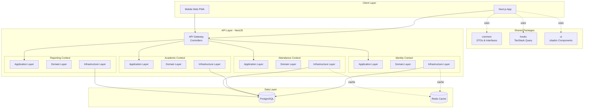

### 2.2 Capas de la Arquitectura Hexagonal

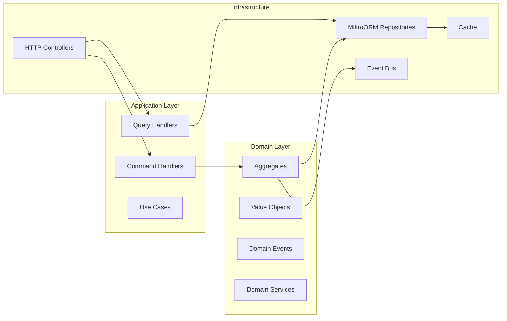

---

## 3. Bounded Contexts

El sistema se divide en 4 bounded contexts independientes con límites bien definidos:

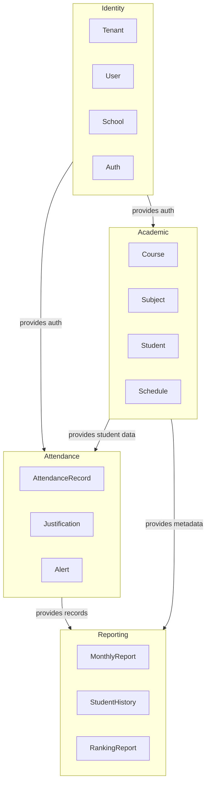

### 3.1 Comunicación entre Contextos

Los bounded contexts se comunican vía **Domain Events** (asíncrono) y **referencias por ID** (síncrono cuando es inevitable).

**Principio:** Un Aggregate Root nunca referencia directamente a otro Aggregate Root. Solo usa su ID (como Value Object).

Ejemplo:
- `AttendanceRecord` NO tiene una referencia a `Student` (aggregate).
- `AttendanceRecord` tiene un `StudentId` (value object).

---

## 4. Modelo de Datos

### 4.1 Entity Relationship Diagram

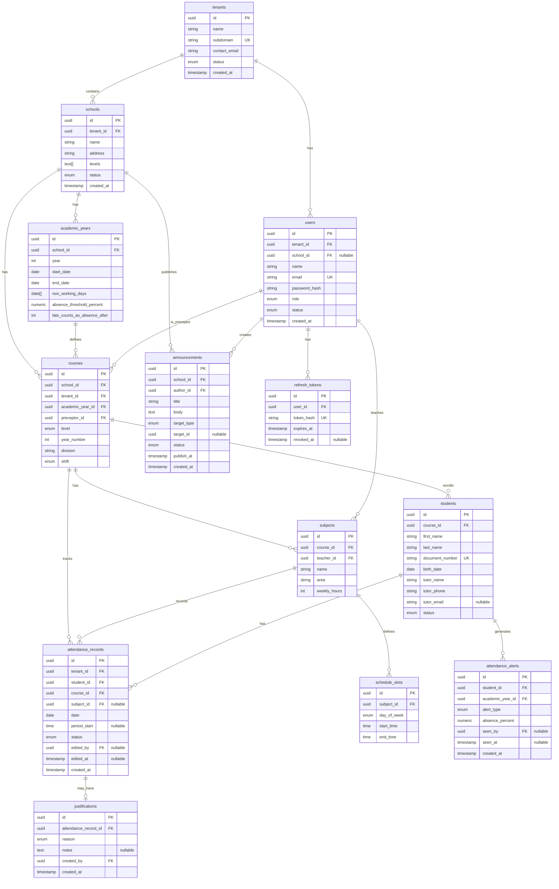

### 4.2 Decisiones de Diseño del Modelo

#### tenant_id redundante

Aunque `students` ya tiene `course_id` que apunta a `courses` que tiene `tenant_id`, agregamos `tenant_id` directamente en `attendance_records` para:
- Queries con un solo filtro sin joins
- Row Level Security (RLS) de PostgreSQL más simple
- Índices más eficientes

#### subject_id nullable en attendance_records

Discriminador entre primaria y secundaria:
- `subject_id = NULL` → registro diario de primaria
- `subject_id != NULL` → registro por materia de secundaria

Alternativa descartada: dos tablas separadas (`daily_attendance` y `subject_attendance`) complicaría reportes consolidados.

#### attendance_alerts como tabla

Podría calcularse on-the-fly, pero persistirlo permite:
- Marcar alertas como vistas (UX crítico para preceptores)
- Historial de cuándo se disparó cada alerta
- Base para futuras notificaciones push

---

## 5. Flujo de Autenticación

### 5.1 Diagrama de Secuencia - Login

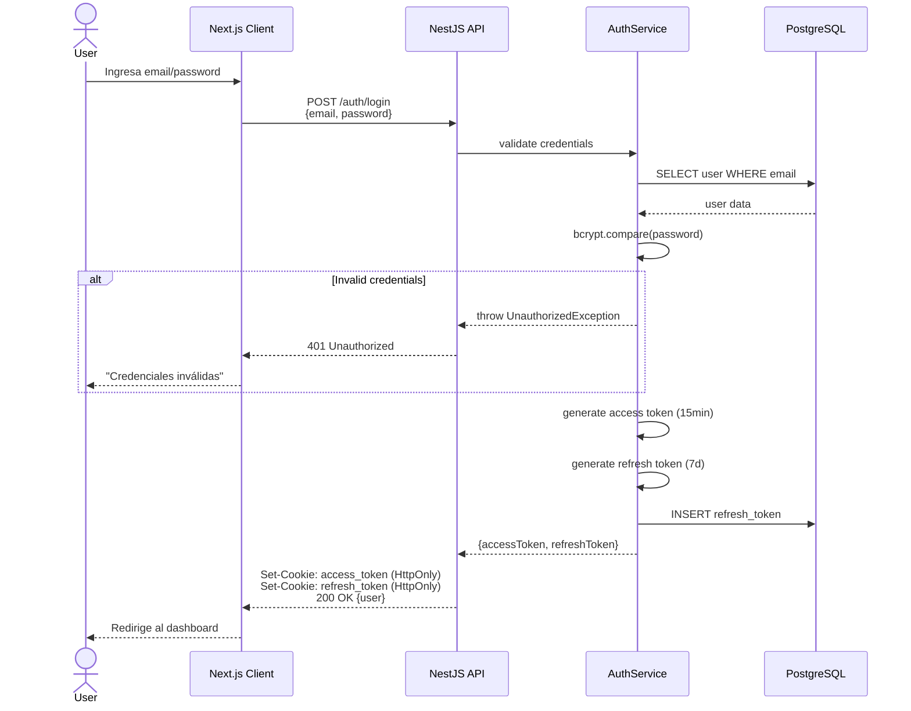

### 5.2 Diagrama de Secuencia - Request Autenticado

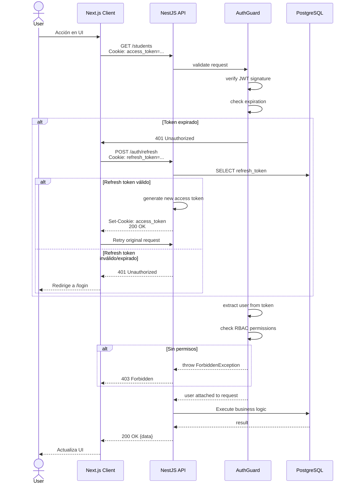

### 5.3 Configuración de Cookies

```typescript
// access_token
httpOnly: true
secure: true (solo HTTPS)
sameSite: 'strict'
maxAge: 15 minutes
path: '/'

// refresh_token
httpOnly: true
secure: true
sameSite: 'strict'
maxAge: 7 days
path: '/auth/refresh'
```

---

## 6. Casos de Uso Principales

### 6.1 Registrar Asistencia (Secundaria)

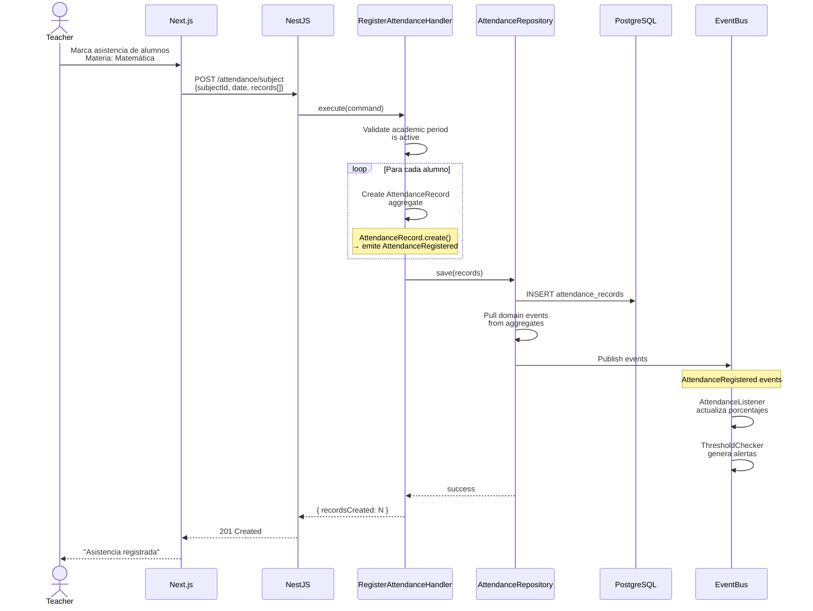

### 6.2 Ver Panel de Preceptoría

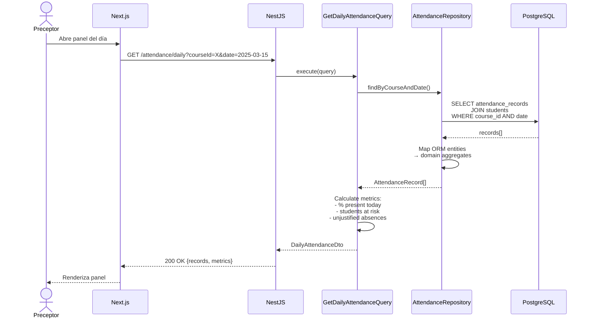

---

## 7. Stack Tecnológico

### 7.1 Backend

| Componente | Tecnología | Versión | Justificación |
|---|---|---|---|
| Runtime | Node.js | 20 LTS | Estabilidad a largo plazo |
| Framework | NestJS | 10.x | DI nativo, modular, decorators |
| ORM | MikroORM | 6.x | Type-safe, Unit of Work pattern |
| Base de datos | PostgreSQL | 16 | JSONB, arrays, índices avanzados |
| Validación | class-validator | 0.14 | Decorators, integración NestJS |
| Auth | Passport + JWT | - | Estrategias pluggables |
| Testing | Jest | 29.x | Ecosystem maduro |

### 7.2 Frontend

| Componente | Tecnología | Versión | Justificación |
|---|---|---|---|
| Framework | Next.js | 15.x | App Router, RSC, SSR |
| UI Library | shadcn/ui | - | Componentes accesibles, Tailwind |
| State Management | TanStack Query | 5.x | Server state, caching automático |
| Forms | React Hook Form | 7.x | Performance, validación |
| Validación | Zod | 3.x | Type-safe schemas, DX |

### 7.3 Monorepo

| Componente | Tecnología | Justificación |
|---|---|---|
| Build System | Turborepo | Caching inteligente, pipelines |
| Package Manager | pnpm | Workspaces, deduplicación |
| Linting | Biome | Rápido, todo-en-uno |
| Git Hooks | Husky + Commitlint | Conventional commits |

---

## 8. Deployment

### 8.1 Diagrama de Infraestructura

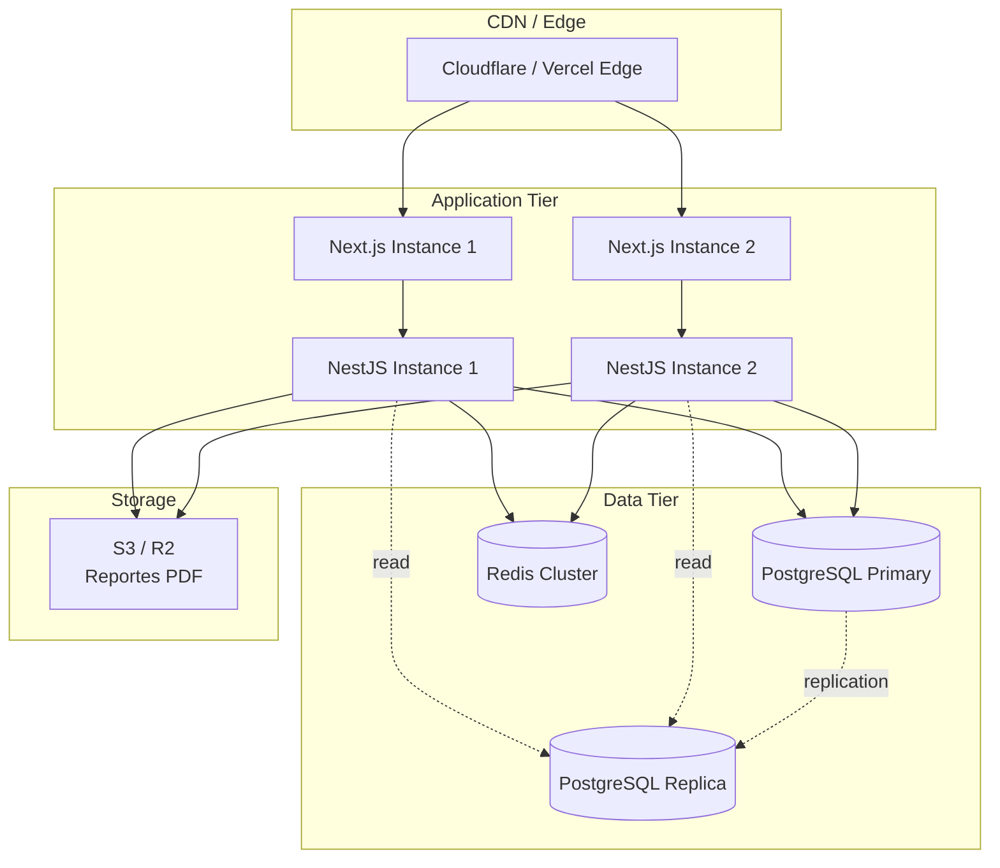

### 8.2 Estrategia de Deployment

**Environments:**
- `dev` → Railway / Render (bajo costo, CI/CD automático)
- `staging` → Réplica de producción con datos fake
- `production` → AWS ECS / GCP Cloud Run

**CI/CD Pipeline:**

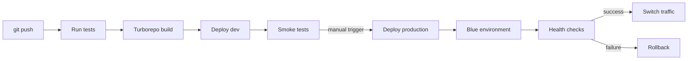

---

## 9. Seguridad

### 9.1 Capas de Seguridad

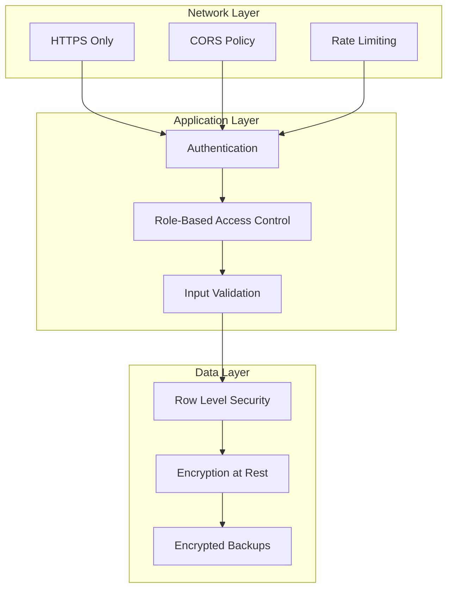

### 9.2 Controles por Capa

#### Network
- TLS 1.3 obligatorio
- CORS configurado por origen
- Rate limiting: 100 req/min por IP

#### Application
- JWT con rotación de refresh tokens
- RBAC con verificación en cada endpoint
- class-validator en todos los DTOs
- Sanitización de inputs (XSS)
- CSRF tokens en formularios críticos

#### Data
- Passwords con bcrypt (cost 12)
- Row Level Security de PostgreSQL por `tenant_id`
- Datos sensibles (passwords) nunca en logs
- Backups encriptados con KMS

---

## Apéndice A: Glosario

| Término | Definición |
|---|---|
| **Aggregate Root** | Entidad principal de un grupo de objetos relacionados. Único punto de entrada para modificar ese grupo. |
| **Bounded Context** | Límite explícito dentro del cual un modelo de dominio es definido y aplicable. |
| **Domain Event** | Algo que ocurrió en el pasado dentro del dominio. Inmutable, con nombre en pasado. |
| **Value Object** | Objeto que se define únicamente por su valor, no por una identidad. Inmutable. |
| **Multi-tenancy** | Arquitectura donde una sola instancia de software sirve a múltiples clientes (tenants) con datos aislados. |
| **DDD** | Domain-Driven Design. Enfoque de modelado donde el dominio es el centro del diseño del software. |

---

## Apéndice B: Referencias

- **Domain-Driven Design** (Eric Evans)
- **Implementing Domain-Driven Design** (Vaughn Vernon)
- **NestJS Documentation** - https://docs.nestjs.com
- **MikroORM Documentation** - https://mikro-orm.io
- **PostgreSQL Multi-tenancy Strategies** - https://www.citusdata.com/blog/

---

**Fin del documento**
