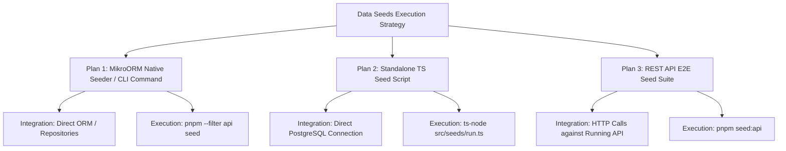

# Plan de Data Seeds y Estrategia de Demo para Vir-ttend

**Versión:** 1.0  
**Fecha:** Agosto 2026  
**Objetivo:** Definir el conjunto de datos de prueba (*Data Seeds*) y las estrategias de ejecución para evaluar el 100% de los endpoints y funcionalidades del backend y frontend de Vir-ttend.

---

## 1. Objetivos del Plan de Demo

El dataset de demostración está diseñado para evaluar exhaustivamente:
1. **Multi-Tenancy y Aislamiento de Datos**: Verificación de row-level isolation entre distintos colegios.
2. **Control de Acceso basado en Roles (RBAC)**: Autenticación y permisos para `SUPERADMIN`, `ADMIN`, `PRECEPTOR` y `TEACHER`.
3. **Doble Modalidad de Asistencia**:
   - **Primaria**: Registro diario global por curso (`subject_id = NULL`).
   - **Secundaria**: Registro por materia y módulo/período (`subject_id != NULL`).
4. **Sistema de Alertas Dinámicas**: Disparo de alertas por acumulación de inasistencias acumuladas y estado de lectura (`seenBy`, `seenAt`).
5. **Justificaciones e Historial**: Carga de certificados y trazabilidad de ediciones (`editedBy`, `editedAt`).
6. **Comunicados Institucionales**: Filtrado por destinatario (`ALL`, `COURSE`, `TEACHERS`, `PRECEPTORS`) y ciclo de vida (`DRAFT` vs `PUBLISHED`).
7. **Reportes y Exportación**: Generación y caché en Redis de resúmenes mensuales y exportación a **Excel** y **PDF**.

---

## 2. Especificación Detallada del Dataset (Data Seeds)

### 2.1 Tenants (Instituciones Educativas)

| Subdominio | Nombre Completo | Niveles | Estado | Propósito de Prueba |
|---|---|---|---|---|
| `san-martin` | Colegio Inst. San Martín | Primaria y Secundaria | `ACTIVE` | Tenant principal de demo con datos completos. |
| `belgrano` | Instituto Belgrano | Solo Secundaria | `ACTIVE` | Pruebas de tenant monociclo secundaria. |
| `sol-del-sur` | Escuela Sol del Sur | Primaria | `SUSPENDED` | Pruebas de bloqueo por tenant suspendido. |

---

### 2.2 Usuarios y Credenciales de Demo

Todas las cuentas usan la contraseña por defecto: **`Demo1234!`**

| Email | Nombre | Rol | Tenant | Contexto de Evaluación |
|---|---|---|---|---|
| `superadmin@virttend.com` | Carlos Ramos | `SUPERADMIN` | Sistema | Gestión global de tenants y plataforma. |
| `admin.sanmartin@virttend.com` | Ana María Gómez | `ADMIN` | `san-martin` | Configuración académica, comunicados y usuarios. |
| `preceptor.primaria@virttend.com` | Roberto López | `PRECEPTOR` | `san-martin` | Toma de asistencia diaria (Primaria) y alertas. |
| `preceptor.secundaria@virttend.com` | Laura Martínez | `PRECEPTOR` | `san-martin` | Asistencia secundaria, justificaciones y reportes. |
| `profesor.matematica@virttend.com` | Javier Pérez | `TEACHER` | `san-martin` | Carga de asistencia por materia (Matemática). |
| `profesor.historia@virttend.com` | Elena Fernández | `TEACHER` | `san-martin` | Carga de asistencia por materia (Historia). |

---

### 2.3 Estructura Académica (Tenant `san-martin`)

#### Año Académico 2026
- **Período**: `2026-03-02` al `2026-12-18`
- **Umbral de Ausencias**: `15%`
- **Equivalencia de Tardanzas**: `3` tardanzas = `1` inasistencia
- **Días no lectivos**: Feriados nacionales (ej. 25 de mayo, 9 de julio) y jornadas pedagógicas.

#### Cursos y Materias

1. **Primaria — `1º Grado A` (Turno Mañana)**
   - Preceptor asignado: `preceptor.primaria@virttend.com`
   - Registro de asistencia: **Diario** (`subjectId = null`)

2. **Secundaria — `3º Año A` (Turno Mañana)**
   - Preceptor asignado: `preceptor.secundaria@virttend.com`
   - **Materias y Horarios**:
     - *Matemática*: Lunes 08:00 - 09:20, Miércoles 08:00 - 09:20 (Prof. Javier Pérez)
     - *Historia*: Martes 09:30 - 10:50, Jueves 09:30 - 10:50 (Prof. Elena Fernández)
     - *Lengua y Literatura*: Lunes 09:30 - 10:50, Viernes 08:00 - 09:20

---

### 2.4 Perfiles de Estudiantes para Evaluación (Historias de Usuario)

Se sembrarán **12 alumnos por curso** con historiales intencionados para cubrir todos los casos borde:

| Estudiante | Curso | Perfil / Historial de Asistencia | Casos de Prueba Asociados |
|---|---|---|---|
| **Martín Benítez** | 3º Año A | **Asistencia Perfecta**: 100% presente los últimos 30 días. | Cálculo de 0% inasistencias, sin alertas. |
| **Sofía Rossi** | 3º Año A | **Al borde del Umbral**: 12% inasistencias. | Disparo de alerta `WARNING` no vista. |
| **Joaquín Díaz** | 3º Año A | **Umbral Excedido (Crítico)**: 18% inasistencias. | Alerta `CRITICAL` no vista, visualización en Dashboard. |
| **Lucía Morales** | 3º Año A | **Tardanzas Frecuentes**: 6 tardanzas registradas. | Conversión de tardanzas a inasistencias (2 ausencias equivalentes). |
| **Mateo Giménez** | 3º Año A | **Ausencias Justificadas**: 4 ausencias con certificado médico. | Endpoint de justificación `/attendance/:id/justify` y reportes ajustados. |
| **Valentina Fernández** | 1º Grado A | **Asistencia Primaria Regular**: Presente con 1 falta diaria. | Asistencia diaria de primaria (`subjectId = null`). |
| **Santiago Paz** | 1º Grado A | **Primaria Alerta Crítica**: 20% inasistencias diarias. | Alertas en nivel primario. |

---

### 2.5 Asistencias, Justificaciones y Alertas (Últimos 30 días)

- **Registros de Asistencia**: Sembrado continuo para los días lectivos pasados (lunes a viernes).
- **Justificaciones**: Registros de tipo `MEDICAL`, `FAMILY` y `SPORTS` adjuntos a inasistencias específicas.
- **Alertas Generadas**:
  - Alerta `WARNING` para Sofía Rossi (`seen = false`).
  - Alerta `CRITICAL` para Joaquín Díaz (`seen = false`).
  - Alerta `WARNING` resuelta para Santiago Paz (`seen = true`, `seenBy` preceptor, `seenAt` timestamp).

---

### 2.6 Comunicados Institucionales (Announcements)

1. **Comunicado General (`PUBLISHED`)**: "Inicio de Talleres Extracurriculares" (`targetType: ALL`).
2. **Comunicado Docentes (`PUBLISHED`)**: "Reunión de Personal Docente - Viernes 14hs" (`targetType: TEACHERS`).
3. **Comunicado Curso (`PUBLISHED`)**: "Salida Didáctica a Museo Histórico" (`targetType: COURSE`, `targetId: 3º Año A`).
4. **Borrador (`DRAFT`)**: "Circular Informativa Exámenes Trimestrales" (`status: DRAFT`).

---

## 3. Matriz de Cobertura de Endpoints de la API

La siguiente tabla detalla cómo el dataset de demo evalúa cada endpoint:

| Módulo | Método | Endpoint | Datos de Prueba / Casos de Evaluación |
|---|---|---|---|
| **Auth** | `POST` | `/auth/login` | Login con credenciales demo (ej. `admin.sanmartin@virttend.com`). |
| **Auth** | `POST` | `/auth/select-tenant` | Selección del tenant `san-martin` o `belgrano`. |
| **Auth** | `GET` | `/users/me` | Retorna perfil y membresías del usuario autenticado. |
| **Tenants** | `GET` | `/tenants` | Lista tenants (`san-martin`, `belgrano`, `sol-del-sur`). |
| **Tenants** | `PATCH` | `/tenants/:id/status` | Probar cambiar estado de tenant. |
| **Académico** | `GET` | `/academic-years` | Retorna el ciclo lectivo 2026 de `san-martin`. |
| **Académico** | `GET` | `/courses` | Lista los cursos de Primaria (`1º Grado A`) y Secundaria (`3º Año A`). |
| **Académico** | `GET` | `/subjects` | Retorna las materias del curso `3º Año A`. |
| **Académico** | `GET` | `/schedule` | Horarios semanales por materia. |
| **Académico** | `GET` | `/students` | Búsqueda y listado paginado de estudiantes. |
| **Asistencia**| `POST` | `/attendance/daily` | Carga de asistencia diaria de Primaria. |
| **Asistencia**| `POST` | `/attendance/subject` | Carga de asistencia por materia de Secundaria. |
| **Asistencia**| `GET` | `/attendance/student/:studentId` | Historial de Joaquín Díaz o Martín Benítez. |
| **Asistencia**| `POST` | `/attendance/:id/justify` | Justificar inasistencia de Sofía Rossi. |
| **Alertas** | `GET` | `/alerts/unseen` | Retorna las alertas no vistas (Sofía Rossi, Joaquín Díaz). |
| **Alertas** | `GET` | `/alerts/count` | Retorna el contador exacto de alertas pendientes (ej. `2`). |
| **Alertas** | `PATCH` | `/alerts/:id/seen` | Marcar alerta como vista y verificar actualización en tiempo real. |
| **Dashboard** | `GET` | `/dashboard` | Resumen general con porcentaje global, ausencias del día y alertas. |
| **Dashboard** | `GET` | `/dashboard/course/:courseId` | Métricas específicas del curso `3º Año A`. |
| **Comunicados**| `GET` | `/announcements/for-me` | Comunicados recibidos según el rol del usuario autenticado. |
| **Reportes** | `GET` | `/reports/monthly` | Reporte mensual del curso `3º Año A` para el mes actual. |
| **Export** | `POST` | `/reports/export/excel` | Exporta planilla de asistencia de demo a formato `.xlsx`. |
| **Export** | `POST` | `/reports/export/pdf` | Exporta informe de inasistencias de demo a `.pdf`. |

---

## 4. Planes de Ejecución e Implementación Propuestos

Proponemos 3 alternativas de implementación técnica para la ejecución de los Data Seeds:

### Plan 1: Seeder Nativo MikroORM + Comando CLI (`pnpm seed`) ⭐ *(Recomendado)*
- **Descripción**: Se implementa utilizando la extensión `@mikro-orm/seeder` o mediante una clase `DatabaseSeeder` integrada en NestJS.
- **Ventajas**:
  - Utiliza los mappers y repositorios del dominio de la aplicación.
  - Se puede invocar fácilmente con `pnpm --filter api seed` o durante el arranque en Docker (`compose.yml`).
  - Totalmente seguro con transacciones (`em.transactional()`).
- **Ubicación propuesta**: `apps/api/src/modules/shared/database/seeders/demo.seeder.ts`

---

### Plan 2: Script Standalone de Inserción Directa (`pnpm seed:standalone`)
- **Descripción**: Script independiente en TypeScript que se conecta a la base de datos PostgreSQL utilizando `@mikro-orm/core` o SQL directo para insertar datos sintéticos de prueba.
- **Ventajas**:
  - Cero footprint en el paquete de producción de NestJS.
  - Ejecución ultra rápida.
- **Ubicación propuesta**: `apps/api/scripts/seed-demo.ts`

---

### Plan 3: Suite de Poblamiento vía API REST (`pnpm seed:api`)
- **Descripción**: Un script que ejecuta peticiones HTTP secuenciales a los endpoints públicos y privados de la API levantada en `localhost:3000`.
- **Ventajas**:
  - Valida simultáneamente los DTOs, pipes de validación, JWT Guards y disparadores de eventos de dominio/alertas.
  - Útil para verificación E2E completa del sistema.
- **Ubicación propuesta**: `apps/api/test/e2e/seed-demo.e2e-spec.ts`

---

## 5. Próximos Pasos Recomendados

1. **Aprobación del Plan de Datos y Elección del Plan de Ejecución** (Se recomienda el **Plan 1**).
2. **Creación del Seeder**: Implementar el archivo `demo.seeder.ts` con la estructura especificada.
3. **Comando pnpm**: Registrar `"seed": "ts-node -r tsconfig-paths/register src/modules/shared/database/seeders/run-seed.ts"` en `apps/api/package.json`.
4. **Verificación**: Ejecutar la siembra y validar mediante Swagger (`http://localhost:3000/docs`) y en la aplicación Next.js client.
